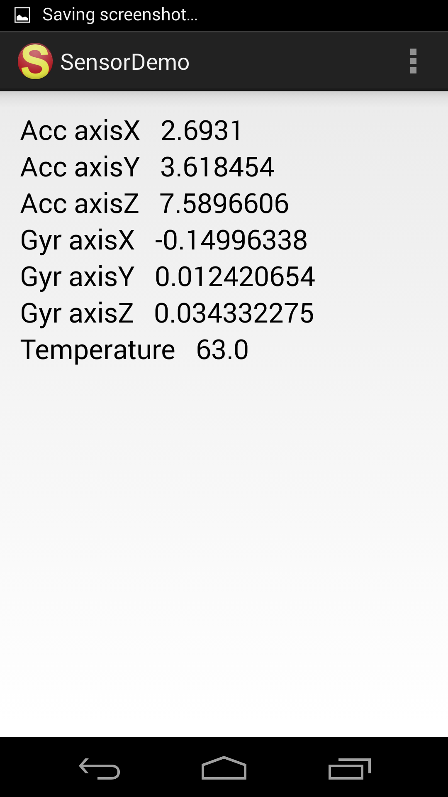

# Android Sensor Demo

* Accelerometer
* Gyroscope
* Light

### TODO
implement other sensors
* Ambient temperature
* Gravity
* Magnetic Field
* Pressure
* Proximity
* Relative humidity
* Step counter
* Step detector
* etc
